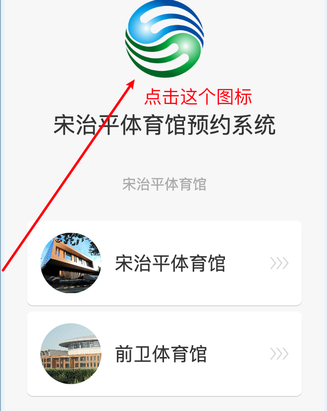

# 页面说明

本文档描述项目中的页面内容、可点击区域和一条完整的演示路径。所有预约信息都是本地演示数据，
页面不连接吉林大学体育馆预约后台。

- 在线演示：[https://gym.meiyh9924.xyz/](https://gym.meiyh9924.xyz/)
- 项目源码：[xiaoyoumi9924/jlu-gym-frontend](https://github.com/xiaoyoumi9924/jlu-gym-frontend)

建议使用手机浏览器访问；在电脑端查看时，可以将浏览器开发者工具切换到约 390px 宽的移动设备视图。

## 页面总览

| 路由 | 页面 | 主要模块 |
| --- | --- | --- |
| `#/venues` | 场馆选择 | 平台 Logo、标题、两张场馆卡片、预约设置弹窗、保存成功弹窗 |
| `#/home/:venueId` | 场馆首页 | 场馆标题、轮播图、地址、简介、联系电话、场馆安排、在线功能 |
| `#/reserve/:venueId` | 场地预约 | 「场地」标签、项目卡片列表、轻提示 |
| `#/profile` | 个人中心 | 渐变资料头、我的助手（四个入口） |
| `#/my-bookings` | 我的预约 | 标签、日期区间、订单卡片或空状态、悬浮返回 |
| `#/my-bookings/detail` | 预约详情 | 项目缩略图、场地与起止时间、入场码弹窗、悬浮返回 |

`venueId` 只有两个取值：`song`（宋治平体育馆）、`qianwei`（前卫体育馆）。
传入其他值时会回退到宋治平体育馆。

## 场馆选择 `#/venues`

- 点击任意场馆卡片：记住该场馆并进入它的首页。
- 点击平台 Logo：打开「预约设置」弹窗。
- 「预约设置」弹窗可填写体育馆、运动项目、日期、时间段、场地号，点「保存预约」写入演示数据并
  关闭弹窗，随后出现「保存成功」弹窗（可点「确定」或右上角 × 关闭）。
- 运动项目下拉框的选项来自所选体育馆；切换体育馆后会自动选中该项目列表的第一项。

*预约设置的入口是页面顶部的平台 Logo，点击它就打开「预约设置」弹窗。*

## 场馆首页 `#/home/:venueId`

- 轮播图每 4.5 秒自动切换，点击底部圆点可手动切换。
- 「查看其他校区」返回场馆选择页。
- 「联系电话」是 `tel:` 链接。
- 「场地预约」进入该场馆的预约项目列表。
- 场馆安排卡片、简介的「更多」、「在线购票」、「敬请期待...」目前是纯展示控件，点击没有响应。

## 场地预约 `#/reserve/:venueId`

- 「场地」标签只做视觉标示。
- 项目卡片按数据顺序展示项目名称与开始营业时间。
- 点击「预约场地」只弹出一条 1.8 秒的轻提示：`演示页面不连接预约后台`，不会创建任何预约。

## 个人中心 `#/profile`

- 固定显示课程作业要求的身份：李子涵 / 学号 87240433 / 男性图标。
- 「我的预约」进入 `#/my-bookings`。
- 「我的邀请」「购票记录」「敬请期待...」为纯展示入口。

## 我的预约 `#/my-bookings`

- 「选择日期区间」为纯展示控件。
- 有演示预约时显示订单卡片：订单号、场地、数量、购买时间，以及「查看详情」「取消预约」。
- 「取消预约」会把订单状态改为已取消，卡片上出现「已取消」并隐藏取消按钮，数据保留。
- 没有演示预约时显示「暂无预约」空状态。
- 右下角悬浮按钮返回到个人中心。

## 预约详情 `#/my-bookings/detail`

- 显示场地（项目名 + 场地号）和开始/结束时间。
- 右上角小二维码图标打开「入场码」弹窗，弹窗内显示票券边框、场地标签和二维码。票券按
  `240 × 300px` 展示，二维码为 `150 × 150px`，比例与参考页面一致。
- 「同行人」为纯展示控件；右下角悬浮按钮返回我的预约。

> 入场码弹窗中的二维码是一张固定的本地占位图片，仅用于还原界面，**不代表任何真实入场权限，
> 不能用于任何真实场馆核验**。

## 推荐演示路径

1. `#/venues` → 点击「宋治平体育馆」进入首页。
2. 等待或点击圆点切换轮播图。
3. 「场地预约」→ 点一张卡片的「预约场地」，看到轻提示。
4. 底部导航切到「我的」，确认姓名与学号。
5. 从首页「查看其他校区」回到 `#/venues`，点击 Logo 打开预约设置。
6. 选择体育馆、日期、时间段，点「保存预约」→「保存成功」→「确定」。
7. 「我的」→「我的预约」，查看订单卡片；「查看详情」→ 右上角二维码图标查看入场码。
8. 返回后点「取消预约」，确认订单变为「已取消」。

## 重置演示数据

- 预约数据存在 `sessionStorage` 的 `jlu-gym-mock-booking`，关闭标签页即自动清空。
- 当前场馆存在 `localStorage` 的 `jlu-gym-active-venue`，清空后回到宋治平体育馆。

## 相关文档

- [返回项目 README](../README.md)
- [查看技术说明](技术说明.md)
